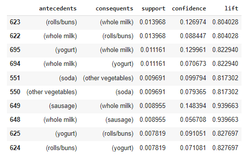

<h1 align="center">
  🛒 Market Basket Analysis
</h1>

<p align="center">
    
    
### 🤔 What's Market Basket Analysis?
**Market basket analysis** is a powerful data science (data mining) application that improves user experience and encourages purchases by better understanding customer purchasing patterns, which *increase sales and adds direct business value to companies*. **Market basket analysis** is an analysis technique used by companies to identify combinations of products or items that are often purchased simultaneously in a transaction. By applying this technique, companies can manage product availability (inventory), determine marketing targets and business strategies (determining sales, discounts, etc.).

### 🤷‍♂️ How Does Market Basket Analysis Work?
**Market basket analysis** is a technique for *uncovering associations between items*. By looking at combinations of items that occur simultaneously in transactions, or you could say looking for items that are often purchased by consumers together with other items.

Notice, when visiting the grocery store how bread, butter, and jam are always sold in the same aisle. Similarly milk and diapers are all placed near each other so customers can easily purchase them together.

### 🚩 Apriori Algorithm
The **Apriori algorithm** is the most common technique for performing market basket analysis. This algorithm uses **association rule mining**, which is a rule-based process used to identify correlations between items purchased by users.

The Apriori Algorithm has three main components that can be said to be the main metrics for determining the connectedness of each combination of items:
- **Support**, used to assess the overall popularity of a given product.
- **Confidence**, likelihood of different purchase combinations
- **Lift**, refers to the increase in the ratio of the sale of A when you sell B

### 🗃️ Dataset
<p>The dataset used comes from <b>Kaggle</b>, it's called <b>Grocery Dataset</b> by Heeral Dedhia.</p> 
<p>It contains <b>3 columns</b> with <b>38765 rows/values</b>.</p>
🗃: [Grocery Dataset️](https://www.kaggle.com/datasets/heeraldedhia/groceries-dataset/data).

Sample dataset:
| Member_number | Date | itemDescription |
| --- | --- | --- |
| 1808 | 210-07-2015 | tropical fruit |
| 2552 | 05-01-2015 | whole milk |
| 2300 | 19-09-2015 | pip fruit |
| 1187 | 12-12-2015 | other vegetables |
| ... | ... | ... | 

##### Content:
**People**
| Columns | Detail |
| ------- | ------ |
| Member_number | ID of customer |
| Date | Date of purchase |
| itemDescription | Description of product purchased |

### 🗂️ Libraries Prequisites
1. **Pandas**
   ```
   !pip install pandas
   import pandas as pd
   ```

3. **Apriori** from MLXtend
    ```
    # if need to be installed
    !pip install mlxtend
    ```
    ```
    #import the apriori
    from mlxtend.frequent_patterns import apriori
    from mlxtend.frequent_patterns import association_rules
    ```

### 🤖 Result


The resulting table shows that the **five most popular product combinations** that are frequently bought together are:
- Rolls and Milk
- Yoghurt and Milk
- Soda and Vegetables
- Sausage and Milk
- Yoghurt and Rolls
